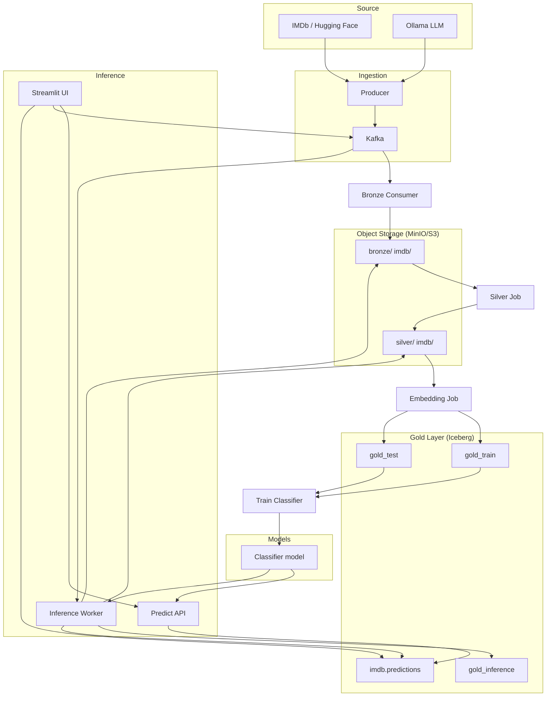

# text-ml-platform

[](https://github.com/dyh/text-ml-platform/actions/workflows/ci.yml)
[](https://www.python.org/downloads/)
[](LICENSE)
[](https://docs.astral.sh/ruff/)

A production-style **text ML platform** for ingestion, transformation, feature engineering, and training. Demonstrates a full end-to-end pipeline: streaming text data into Kafka, landing it in a bronze/silver/gold medallion architecture, training a sentiment classifier, and serving predictions via sync and async inference paths.

---

## Why This Matters

**Importance:** Modern ML systems need more than a one-off notebook. They require:

- **Reproducible pipelines** – Data flows through defined stages (bronze → silver → gold) with clear lineage
- **Scalable ingestion** – Kafka decouples producers and consumers, enabling batch and real-time streaming
- **ACID storage** – Apache Iceberg provides time travel, schema evolution, and safe concurrent writes
- **Operational flexibility** – Sync (HTTP) and async (Kafka → worker) inference modes for different latency and throughput needs

**Potential usage:**

| Use case | How this platform fits |
|----------|------------------------|
| **Sentiment / text classification** | Ready-to-use IMDb demo; swap in your own dataset and labels |
| **MLOps / production ML** | Kubeflow pipeline definitions, Docker Compose for local dev, Iceberg for feature store |
| **Data engineering learning** | Medallion architecture, Kafka, MinIO/S3, Iceberg patterns in one place |
| **Embedding + classifier stack** | BERT embeddings → gold layer → logistic regression; extensible to other encoders |
| **Async inference at scale** | Kafka consumer worker pattern for high-throughput, fire-and-forget predictions |

---

## Architecture

Data flows from source to prediction through these stages:



**High-level flow:**

1. **Ingestion:** Producer streams IMDb reviews (or Ollama-generated text) into Kafka.
2. **Bronze:** Consumer writes raw JSONL to MinIO under `bronze/imdb/<split>/`.
3. **Silver:** Silver job cleans text, deduplicates, writes to `silver/imdb/<split>/`.
4. **Gold:** Embedding job encodes with BERT, writes to Iceberg tables `imdb.gold_train`, `imdb.gold_test`, and (async) `imdb.gold_inference`.
5. **Training:** Classifier trains on `gold_train`, evaluates on `gold_test`, saves to `models/sentiment_logreg.joblib`.
6. **Inference:**
   - **Sync:** UI → Predict API → BERT + classifier → HTTP response
   - **Async:** UI → Kafka → Inference worker → bronze/silver/gold + `imdb.predictions` → UI polls Iceberg

---

## Structure

- **docker/** – Docker Compose (Kafka, MinIO, Spark, demo services)
- **src/** – Application code (config, ingestion, transformation, features, training, inference, utils)
- **pipelines/** – Kubeflow pipeline definitions
- **tests/** – Unit and integration tests
- **scripts/** – `run_demo*.ps1` / `run_demo*.sh`, `prepopulate_imdb.ps1`

---

## Quick Start (Docker, all-in-one)

From the project root:

```bash
# 1. Start infra + demo services
docker compose -f docker/docker-compose.yml -f docker/docker-compose.demo.gpu.yml up -d --build

# 2. Prepopulate data and train (one-shot)
docker compose -f docker/docker-compose.yml -f docker/docker-compose.demo.gpu.yml run --rm prepopulate_imdb

# 3. Verify Iceberg table
docker compose -f docker/docker-compose.yml -f docker/docker-compose.demo.gpu.yml run --rm gold_iceberg_test

# 4. Open UI
# Streamlit: http://localhost:8501
# Predict API: http://localhost:8000
# Prometheus metrics: http://localhost:8000/metrics
```

**CPU-only:** Replace `docker/docker-compose.demo.gpu.yml` with `docker/docker-compose.demo.yml` and run the same 4 steps (up → prepopulate → gold_iceberg_test → UI).
If you prefer the Makefile shortcuts: `make docker-up-cpu`, `make prepopulate-cpu`, `make docker-rebuild-cpu`.

### Restart everything

```bash
# Stop all services
docker compose -f docker/docker-compose.yml -f docker/docker-compose.demo.gpu.yml down

# Start again (rebuild if you changed code)
docker compose -f docker/docker-compose.yml -f docker/docker-compose.demo.gpu.yml up -d --build

# Re-prepopulate if needed (e.g. after clearing data)
docker compose -f docker/docker-compose.yml -f docker/docker-compose.demo.gpu.yml run --rm prepopulate_imdb
```

**CPU-only (equivalent commands):** replace `docker-compose.demo.gpu.yml` with `docker-compose.demo.yml` (and optionally use the Makefile targets `make docker-up-cpu`, `make prepopulate-cpu`, `make docker-rebuild-cpu`).

---

## Setup (local development)

```bash
pip install -r requirements.txt
```

---

## Usage

### Kafka + IMDb ingestion (manual pipeline)

1. Start Kafka and MinIO:

   ```bash
   docker compose -f docker/docker-compose.yml up -d
   ```

2. Stream IMDb reviews into Kafka:

   ```bash
   python -m src.ingestion.producer --mode batch --limit 100 --split train
   python -m src.ingestion.producer --mode batch --limit 100 --split test
   ```

3. Run bronze consumer (writes to `bronze/imdb/`):

   ```bash
   python -m src.ingestion.bronze_consumer --batch-size 50
   ```

4. Run silver job (cleans, deduplicates, writes to `silver/imdb/`):

   ```bash
   python -m src.transformation.silver_job --bronze-prefix bronze/imdb/train/ --silver-prefix silver/imdb/train/
   python -m src.transformation.silver_job --bronze-prefix bronze/imdb/test/  --silver-prefix silver/imdb/test/
   ```

5. Run embedding job (BERT → gold Parquet or Iceberg):

   ```bash
   # Parquet
   python -m src.features.embedding_job

   # Iceberg (ACID, time travel)
   python -m src.features.embedding_job --iceberg --iceberg-namespace imdb --iceberg-table gold_train
   python -m src.features.embedding_job --iceberg --iceberg-namespace imdb --iceberg-table gold_test
   ```

6. Train classifier:

   ```bash
   python -m src.training.train_classifier \
     --iceberg-identifier imdb.gold_train \
     --test-iceberg-identifier imdb.gold_test \
     --model-out models/sentiment_logreg.joblib
   ```

### Run all demo services (Docker)

After you have run the pipeline at least once so `models/sentiment_logreg.joblib` and Iceberg tables exist:

```bash
# PowerShell (Windows)
./scripts/run_demo_gpu.ps1

# Bash
./scripts/run_demo.sh
```

Or with Docker Compose:

```bash
docker compose -f docker/docker-compose.yml -f docker/docker-compose.demo.yml up -d --build
```

This is the **CPU** version.

- **Streamlit UI:** http://localhost:8501  
- **Predict API:** http://localhost:8000  
- **Prometheus metrics:** http://localhost:8000/metrics (when `prometheus_client` is installed)

**GPU (NVIDIA):** Use the GPU compose for faster BERT inference. Requires [NVIDIA Container Toolkit](https://docs.nvidia.com/datacenter/cloud-native/container-toolkit/install.html).

```bash
./scripts/run_demo_gpu.ps1   # Windows
docker compose -f docker/docker-compose.yml -f docker/docker-compose.demo.gpu.yml up -d --build
```

---

## Tests

Run unit tests from the project root (no PYTHONPATH needed; `conftest.py` adds it):

```bash
pytest tests/ -v
```

Skip the integration test (requires MinIO + Iceberg):

```bash
pytest tests/ -v --ignore=tests/test_gold_iceberg_table.py
```

Run the Iceberg integration test in Docker (after prepopulate):

```bash
docker compose -f docker/docker-compose.yml -f docker/docker-compose.demo.gpu.yml run --rm gold_iceberg_test
```

---

## Configuration

All runtime config lives in `src/config.py` and is overridden by environment variables. Key vars:

| Variable | Default | Description |
|----------|---------|-------------|
| `KAFKA_BOOTSTRAP_SERVERS` | `localhost:9092` | Kafka brokers |
| `KAFKA_INFERENCE_TOPIC` | `imdb-inference` | Topic for UI → `inference_worker` (separate from bulk `imdb-reviews` so prepopulate traffic does not delay async predictions) |
| `S3_ENDPOINT_URL` | `http://localhost:9000` | MinIO endpoint |
| `S3_ACCESS_KEY` / `S3_SECRET_KEY` | `admin` / `password123` | MinIO credentials |
| `ICEBERG_CATALOG_DB` | `.../iceberg_catalog/catalog.db` | SQLite catalog path |
| `PREDICT_API_URL` | `http://localhost:8000/predict` | Predict API (for UI) |
| `GOLD_ICEBERG_IDENTIFIER` | `imdb.gold_train` | Gold table for PCA viz |
| `ASYNC_PREDICTION_TIMEOUT_S` | `180` | Max seconds UI waits for async worker to write prediction |

Docker Compose sets these for containers; override in `docker-compose.*.yml` or `.env` as needed.

---

## Monitoring

With `prometheus_client` installed, the Predict API exposes Prometheus metrics at `/metrics`:

- `predict_requests_total` – Total requests by split
- `predict_latency_seconds` – Request latency histogram
- `predict_label_total` – Predictions by label (0/1)
- `inference_consumed_total` / `inference_success_total` / `inference_failure_total` – Worker stats
- `inference_processing_seconds` – Worker processing time

Scrape with Prometheus or curl: `curl http://localhost:8000/metrics`

---

## Async vs sync inference (latency)

- **Sync:** UI → Predict API → one BERT forward pass + classifier → response. Fastest for interactive use.
- **Async:** UI → Kafka → worker runs the full path (bronze + silver + BERT + Iceberg gold + predictions table) → UI polls Iceberg. Expect several seconds even when healthy: the worker does more I/O and writes than sync mode.

Async requests use a **dedicated** Kafka topic (`imdb-inference` / `KAFKA_INFERENCE_TOPIC`) so they are not queued behind thousands of train/test messages on `imdb-reviews` from prepopulate.

---

## Tutorials

| Notebook | Description |
|----------|-------------|
| `kafka_tutorial.ipynb` | Kafka basics and IMDb producer |
| `stream_to_bronze_tutorial.ipynb` | Producer → Kafka → Bronze consumer |
| `silver_layer_tutorial.ipynb` | Bronze → Silver (cleaning, dedup) |
| `gold_layer_tutorial.ipynb` | Silver → BERT embeddings → Parquet |
| `iceberg_gold_tutorial.ipynb` | Why Iceberg, schema evolution, time travel |
| `production_demo_tutorial.ipynb` | Full flow: Kafka → Bronze/Silver/Gold → Training → UI |

---

## License

MIT -- see [LICENSE](LICENSE).

---

## Clean Python Project Guide

See [RECOMMENDATIONS.md](RECOMMENDATIONS.md) for a guide on writing Python projects that recruiters and hiring managers appreciate (structure, tooling, code quality, testing, CI/CD).
