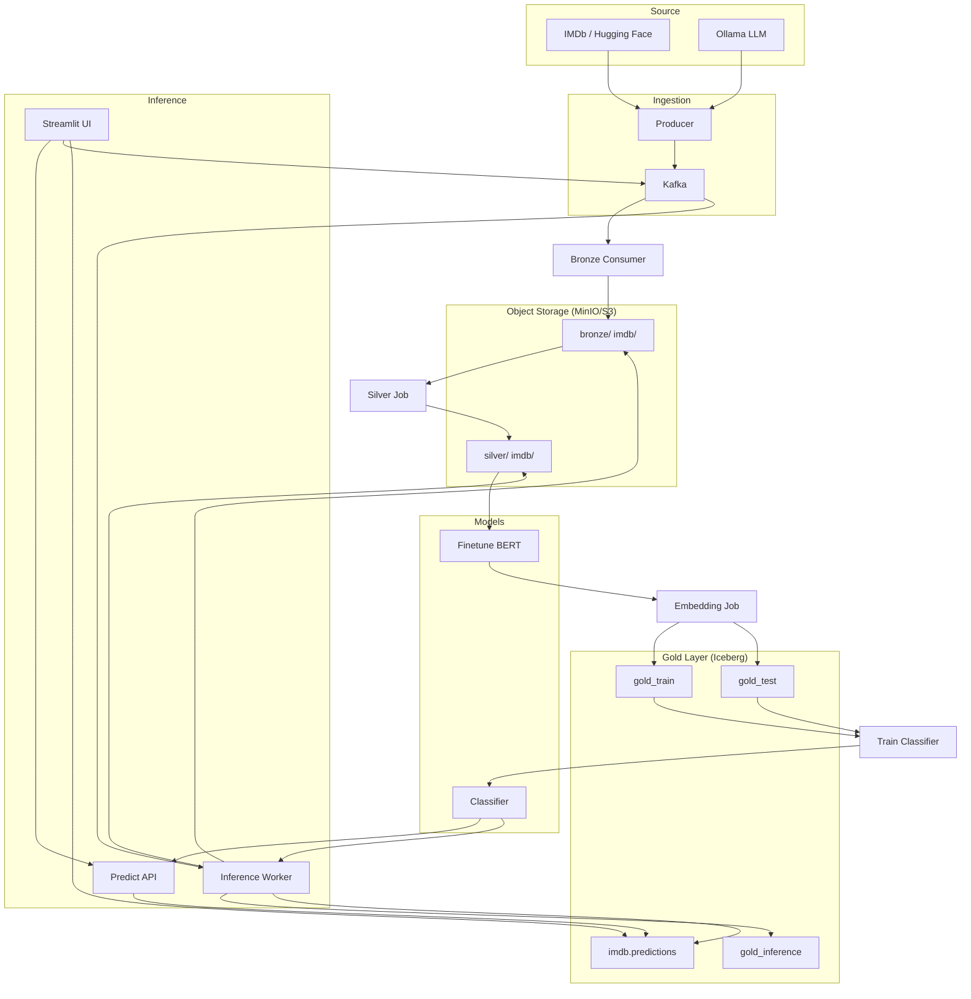

# text-ml-platform

[](https://github.com/dyh1265/text-ml-platform/actions/workflows/ci.yml)
[](https://www.python.org/downloads/)
[](LICENSE)
[](https://docs.astral.sh/ruff/)

A **production-style ML platform** for end-to-end text pipelines: Kafka ingestion → medallion (bronze/silver/gold) → BERT fine-tuning → embeddings → classifier training → sync and async inference. Built with industry patterns: ACID tables, streaming, observability.

### Demo

[](https://youtu.be/BqRECTsd2NU)

---

## Highlights

| Area | What this project demonstrates |
|------|--------------------------------|
| **Data engineering** | Medallion architecture, Kafka streaming, object storage (MinIO/S3), Apache Iceberg for ACID and time travel |
| **ML engineering** | BERT fine-tuning on domain data, embedding pipelines, train/eval split handling, model versioning |
| **Production patterns** | Dual inference paths (sync HTTP + async Kafka worker), Prometheus metrics, Docker Compose dev/prod parity |
| **Code quality** | Ruff linting, pytest with coverage, GitHub Actions CI, Makefile for reproducible commands |
| **Extensibility** | Hugging Face datasets, optional Ollama LLM integration, Kubeflow pipeline definitions |

---

## Tech Stack

| Layer | Technologies |
|-------|--------------|
| **Ingestion** | Kafka, Hugging Face Datasets, Ollama (optional) |
| **Storage** | MinIO (S3-compatible), [Apache Iceberg](https://iceberg.apache.org/) (ACID tables on Parquet), Spark image for catalog compatibility |
| **ML** | PyTorch, Transformers (BERT), scikit-learn, sentence-transformers |
| **Serving** | FastAPI, Streamlit, Kafka consumer worker |
| **Ops** | Docker, Prometheus metrics, structured logging |

---

## Architecture



**Data flow:**

1. **Ingestion** – Producer streams IMDb reviews (or Ollama-generated text) into Kafka.
2. **Bronze** – Consumer writes raw JSONL to MinIO under `bronze/imdb/<split>/`.
3. **Silver** – Silver job cleans text, deduplicates, writes to `silver/imdb/<split>/`.
4. **Fine-tuning** – BERT is fine-tuned on IMDb silver data; output saved to `models/bert_sentiment_imdb`.
5. **Gold** – Embedding job encodes with the fine-tuned BERT, writes to Iceberg tables `gold_train`, `gold_test`, `gold_inference`.
6. **Training** – Classifier trains on `gold_train`, evaluates on `gold_test`, saves to `models/sentiment_logreg.joblib`.
7. **Inference:**
   - **Sync:** UI → Predict API → BERT + classifier → HTTP response
   - **Async:** UI → Kafka → Inference worker → bronze/silver/gold + `imdb.predictions` → UI polls Iceberg

---

## Quick Start (Docker)

From the project root:

```bash
# 1. Start infrastructure + demo services (GPU)
make docker-up
# CPU: make docker-up-cpu

# 2. Prepopulate data, fine-tune BERT, train classifier (one-shot)
make prepopulate
# CPU: make prepopulate-cpu

# 3. Verify Iceberg tables (optional)
docker compose -f docker/docker-compose.yml -f docker/docker-compose.demo.gpu.yml run --rm gold_iceberg_test

# 4. Open the UI
# Streamlit: http://localhost:8501
# Predict API: http://localhost:8000
# Prometheus metrics: http://localhost:8000/metrics
```

**Or use scripts:** `./scripts/run_demo_gpu.ps1` (Windows) / `./scripts/run_demo_gpu.sh` (Bash) to start services, then run prepopulate separately.

**GPU:** Requires [NVIDIA Container Toolkit](https://docs.nvidia.com/datacenter/cloud-native/container-toolkit/install.html). Use `docker-compose.demo.gpu.yml` (default in Makefile) or `docker-compose.demo.yml` for CPU.

---

## Project Structure

| Directory | Contents |
|-----------|----------|
| `src/` | Application code: config, ingestion, transformation, features, training, inference, UI |
| `docker/` | Docker Compose (Kafka, MinIO, Spark, demo services) |
| `pipelines/` | Kubeflow pipeline definitions |
| `tutorials/` | Jupyter notebooks (Kafka, bronze, silver, gold, Iceberg, production demo) |
| `docs/` | Azure deployment sketch, guides |
| `scripts/` | `run_demo*.ps1` / `run_demo*.sh`, `prepopulate_imdb.ps1`, `check_prepopulated.py` |
| `tests/` | Unit and integration tests |

---

## Development

### Local setup

```bash
pip install -r requirements.txt
```

### Run tests

```bash
make test          # Unit tests (excludes Iceberg integration)
make test-cov      # With coverage report
make test-all      # All tests including integration
make lint          # Ruff check
make format        # Ruff format
```

### Manual pipeline (no Docker)

1. Start Kafka + MinIO: `docker compose -f docker/docker-compose.yml up -d`
2. Producer: `python -m src.ingestion.producer --mode batch --limit 100 --split train`
3. Bronze consumer: `python -m src.ingestion.bronze_consumer --batch-size 50 --limit 200`
4. Silver job: `python -m src.transformation.silver_job --bronze-prefix bronze/imdb/train/ --silver-prefix silver/imdb/train/`
5. Fine-tune BERT: `python -m src.training.finetune_bert --silver-train-prefix silver/imdb/train/ --silver-test-prefix silver/imdb/test/ --output-dir models/bert_sentiment_imdb`
6. Embedding job: `python -m src.features.embedding_job --silver-prefix silver/imdb/train/ --iceberg --iceberg-namespace imdb --iceberg-table gold_train --bert-path models/bert_sentiment_imdb`
7. Train classifier: `python -m src.training.train_classifier --iceberg-identifier imdb.gold_train --test-iceberg-identifier imdb.gold_test --model-out models/sentiment_logreg.joblib`

---

## Configuration

Key environment variables (see `src/config.py`):

| Variable | Default | Description |
|----------|---------|-------------|
| `KAFKA_BOOTSTRAP_SERVERS` | `localhost:9092` | Kafka brokers |
| `KAFKA_INFERENCE_TOPIC` | `imdb-inference` | Topic for async UI → inference worker |
| `S3_ENDPOINT_URL` | `http://localhost:9000` | MinIO endpoint |
| `S3_ACCESS_KEY` / `S3_SECRET_KEY` | `admin` / `password123` | MinIO credentials |
| `ICEBERG_CATALOG_DB` | `.../iceberg_catalog/catalog.db` | SQLite catalog path |
| `OLLAMA_API_BASE` | `http://localhost:11434/v1` | Ollama API (for synthetic review generation) |

---

## Monitoring

The Predict API exposes Prometheus metrics at `/metrics` when `prometheus_client` is installed:

- `predict_requests_total`, `predict_latency_seconds`, `predict_label_total`
- `inference_consumed_total`, `inference_success_total`, `inference_failure_total`
- `inference_processing_seconds`

---

## Async vs Sync Inference

| Mode | Path | Use case |
|------|------|----------|
| **Sync** | UI → Predict API → BERT + classifier → HTTP | Interactive, low latency |
| **Async** | UI → Kafka → worker (bronze/silver/gold + predictions) → UI polls Iceberg | High throughput, fire-and-forget |

Async uses a dedicated topic (`imdb-inference`) so it is not blocked by bulk train/test traffic on `imdb-reviews`.

---

## Tutorials (Jupyter)

Run notebooks from the project root so `src` imports work. Example: `jupyter notebook tutorials/kafka_tutorial.ipynb`

| Notebook | Description |
|----------|-------------|
| `tutorials/kafka_tutorial.ipynb` | Kafka basics and IMDb producer |
| `tutorials/stream_to_bronze_tutorial.ipynb` | Producer → Kafka → Bronze consumer |
| `tutorials/silver_layer_tutorial.ipynb` | Bronze → Silver (cleaning, dedup) |
| `tutorials/gold_layer_tutorial.ipynb` | Silver → BERT embeddings → Parquet |
| `tutorials/iceberg_gold_tutorial.ipynb` | Iceberg schema evolution, time travel |
| `tutorials/production_demo_tutorial.ipynb` | Full flow: Kafka → Bronze/Silver/Gold → Training → UI |

---

## License

MIT – see [LICENSE](LICENSE).

---

## Concepts (quick)

| Term | Meaning |
|------|---------|
| **Apache Spark** | Distributed compute engine; here used alongside Iceberg for table metadata / catalog workflows. |
| **Apache Iceberg** | Open table format on object storage: ACID writes, time travel, schema evolution over Parquet files. |

---

## Clean Python Project Guide

See [RECOMMENDATIONS.md](RECOMMENDATIONS.md) for practices that make Python projects maintainable and professional: structure, tooling, testing, CI/CD.
